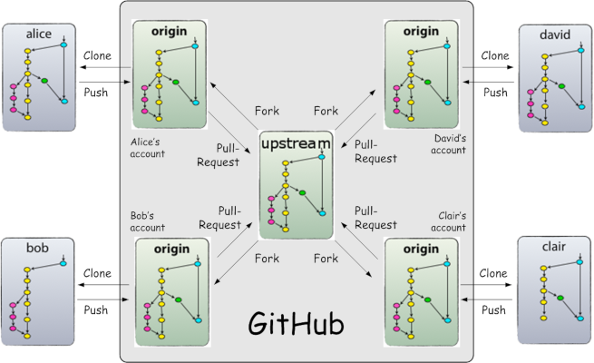

# My Git Cookbook

## General Logic

+ The team has a unique and main repository containing the whole project. It is the **_true_** and **_central_** repository. We shall call it `upstream`.
+ After forking the main repo (`upstream` or what we will interchangeably call **central repo**), you have to clone it to your machine. It will be by default given `origin` as an alias (run `git remote -v` to see what I mean here).
+ You have to add the alias `upstream` afterward to make a link to the central repository from your own machine (`git remote add upstream <link to the central repo>`).
+ This alias (`upstram`) will make it easy to have the last version of the **central repo** (`git pull upstram master` instead of `git pull origin master`).
+ Folks! Use`upstream` exclusively to update your local repo to match the last **central repo** version.
+ Even if you are an admin, everyone has to **fork** the **central repo** and work on the coned version exclusively. 
+ The central repo must hold two **main branches** : `master` & `develop`.
+ We will add other **support branches** like : `feature`, `release` & `hotfix`.
+ Commit changes to the `origin` repo.
+ Push changes to the `origin` repo.
+ Pull changes from the `origin` to the `upstream`.
+ When the `upstream` is updated, pull it to your local.




## Doing it with Git

### Initializing & Creating a Git Repo

#### By Using `git init`

```
git init
git remote add origin https://username@bitbucket.org/project_path.git
git remote -v
git pull origin master
git status
```

#### By using `git clone`

```
git clone https://username@bitbucket.org/project_path.git
cd to_created_folder
git status
git remote -v
```

### Upstream Repository

#### Naming Alias
```
git remote add upstream https://username@bitbucket.org/project_path.git
git remote -v
git status
```

### Git Branching Model

#### Main Branches : Master & Develop

+ **Develop** : this branch is related to the development process before any official release.
+ **Master** : this branch is proper to official releases, the production-ready state.


When the source code in the `develop` branch reaches a stable point and is ready to be released, all the changes should be merged back into master and then tagged with a release number.

#### Supporting Branches
###### Feature Branches

+ **Role** : used to develop new features for the upcoming or a distant future release.
+ **Branch off from** : `develop`.
+ **Merge back into** :  `develop`.
+ **Naming Convention** : anything except `master` , `develop` , `release-*` , or `hotfix-*`.

###### Feature Git Routine
```
git checkout -b mynewfeature develop
git add *
git commit -m "Comment"
git checkout develop
git merge --no-ff mynewfeature
git branch -d mynewfeature
git push origin develop
```

###### Release Branches

+ **Role** : supports preparation of a new production release.
+ **Branch off from** : `develop`.
+ **Merge back into** :  `develop` and `master`.
+ **Naming Convention** : `release-*`.

###### Release Git Routine

```
git checkout -b release-1.2 develop
git commit -a -m "Bumped version number to 1.2"

git checkout master
git merge --no-ff release-1.2
git tag -a 1.2

git checkout develop
git merge --no-ff release-1.2

git branch -d release-1.2
```


###### Hotfix Branches

+ **Role** : it is very much like release branches in that it's also meant to prepare for a new production release, albeit unplanned.
+ **Branch off from** : `master`.
+ **Merge back into to** :  `develop` and `master`.
+ **Naming Convention** : `hotfix-*`.

###### Hotfix Git Routine
```
git checkout -b hotfix-1.2.1 master
git commit -a -m "Bumped version number to 1.2.1"
git commit -m "Fixed severe production problem"
git checkout master
git merge --no-ff hotfix-1.2.1
git tag -a 1.2.1

git checkout develop
git merge --no-ff hotfix-1.2.1

git branch -d hotfix-1.2.1
```


I used Vincent Driessen blog post (https://nvie.com/posts/a-successful-git-branching-model/) as a main source to write this cookbook.